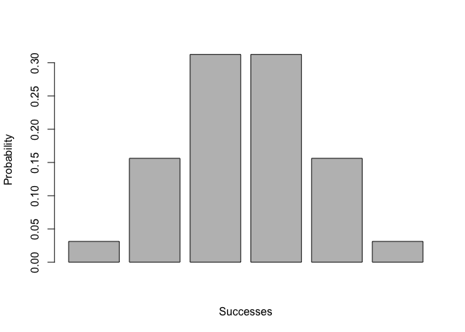
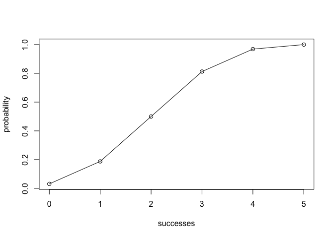

Overview
--------

`binomial` is a package that provides functions for bino mial distributions.

-   `bin_choose()` calculates the number of combinations in which *k* successes can occur in *n* trials.

-   `bin_probability()` calculates the probability in which *k* successes can occur in *n* trials with the probability of success.

-   `bin_distribution()` calculates the binomial distribution with an output as a data frame with class `"bindis","data.frame"`.

-   `plot()` method for a binomial distribution creates a barplot.

-   `bin_cumulative()` calculates the cumulative probability of a binomial distribution. The output is a data frame with class `"bincum","data.frame"`.

-   `plot()` function gives you a line plot of the cumulative distribution.

\*`bin_variable()` gives the binomial variable with class `"binvar"`. It prints out the parameters.

\*`summary()` functions gives you a summary of the variable: mean, variable, mode, skewness, kurtosis.

\*`bin_mean()` calculates mean of binomial distributions.

\*`bin_variance()` calculates variance of binomial.

\*`bin_mode()` calculates mode of binomial distributions.

\*`bin_skewness()` calculates skewness of binomial distributions.

\*`bin_kurtosis()` calculates kurtosis of binomial distributions

Motivation
----------

This package has been developed for the model of binomial distribution.

Usage
-----

``` r
library(binomial)

bin_choose(n = 5, k = 2)
```

    ## [1] 10

``` r
# probability of getting 2 successes in 5 trials
# (assuming prob of success = 0.5) 
bin_probability(success = 2, trials = 5, prob = 0.5)
```

    ## [1] 0.3125

``` r
bin_distribution(trials=5, prob = 0.5)
```

    ##   success probability
    ## 1       0     0.03125
    ## 2       1     0.15625
    ## 3       2     0.31250
    ## 4       3     0.31250
    ## 5       4     0.15625
    ## 6       5     0.03125

``` r
dis1 <- bin_distribution(trials = 5, prob = 0.5)
plot(dis1)
```



``` r
bin_cumulative(trials=5, prob = 0.5)
```

    ##   success probability cumulative
    ## 1       0     0.03125    0.03125
    ## 2       1     0.15625    0.18750
    ## 3       2     0.31250    0.50000
    ## 4       3     0.31250    0.81250
    ## 5       4     0.15625    0.96875
    ## 6       5     0.03125    1.00000

``` r
dis2 <- bin_cumulative(trials = 5, prob = 0.5)
plot(dis2)
```



``` r
bin_variable(trials = 10, p = 0.3)
```

    ## "Binomial variable"
    ## 
    ## Parameters
    ## - number of trials:  10 
    ## - prob of success:  0.3

``` r
bin1 <- bin_variable(trials = 10, p = 0.3)
binsum1 <- summary(bin1)
binsum1
```

    ## "Summary Binomial"
    ## 
    ## Parameters
    ## - number of trials:  10 
    ## - prob of success:  0.3 
    ## 
    ## Measures
    ## - mean:  3 
    ## - variance:  2.1 
    ## - mode:  3 
    ## - skewness:  0.2760262 
    ## - kurtosis:  -0.1238095

``` r
bin_mean(trials = 10, prob = 0.3)
```

    ## [1] 3

``` r
bin_variance(trials = 10, prob = 0.3)
```

    ## [1] 2.1

``` r
bin_mode(trials = 10, prob = 0.3)
```

    ## [1] 3

``` r
bin_skewness(trials = 10, prob = 0.3)
```

    ## [1] 0.2760262

``` r
bin_kurtosis(trials = 10, prob = 0.3)
```

    ## [1] -0.1238095
